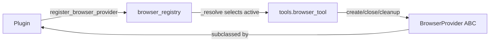
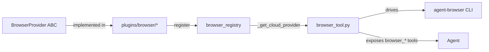

# Explore how the Hermes Agent interact with browser tool #
## How Hermes Agent decides to invoke browser tool #

## The Full Invocation Flow

### 1. Tool Discovery & Registration (build time / startup)

```
plugins/browser/<vendor>/provider.py
    ↓ registers via
agent.browser_registry.register_provider(BrowserbaseBrowserProvider)
agent.browser_registry.register_provider(BrowserUseBrowserProvider)
agent.browser_registry.register_provider(FirecrawlBrowserProvider)
    ↓
tools/browser_tool.py imports those classes and exposes them as module-level
names (BrowserbaseProvider, BrowserUseProvider, FirecrawlProvider) for
backward compat with tests that monkeypatch this module directly.
```

The `browser_*` tool functions (`browser_navigate`, `browser_snapshot`, etc.) are **registered** into the global tool registry via registry.py at import time. Each tool's schema (name, description, parameters) is collected and stored.

### 2. Toolset membership (what tools the agent is allowed to use)

In toolsets.py, the `_HERMES_CORE_TOOLS` list includes all `browser_*` tools:
```python
"browser_navigate", "browser_snapshot", "browser_click",
"browser_type", "browser_scroll", "browser_back",
"browser_press", "browser_get_images",
"browser_vision", "browser_console", "browser_cdp", "browser_dialog",
```

Every platform's toolset inherits this list. A session can be further scoped via `enabled_toolsets` / `disabled_toolsets` — the Tool Search bridge gates which tools are visible and callable in restricted sessions.

### 3. The model decides to call a browser tool

The LLM (Anthropic, OpenAI, etc.) receives a **system prompt** that lists all available tools in schema form. When it decides it needs to navigate to a URL, it emits a `browser_navigate` tool call in its response.

### 4. The API response is received by the agent loop

In run_agent.py / conversation_loop.py, the API response is processed. `assistant_message.tool_calls` is extracted:

```python
tool_calls = getattr(assistant_message, "tool_calls", None) or []
# ↓ passed to:
agent._execute_tool_calls(assistant_message, messages, effective_task_id, api_call_count)
```

### 5. Tool execution dispatch

tool_executor.py handles the actual dispatch. Two paths exist:

- **Sequential** (`_execute_tool_calls_sequential`): tools that may have side effects or share state run one at a time
- **Concurrent** (`_execute_tool_calls_concurrent`): read-only tools can run in parallel

For each `tool_call` in the batch:

```python
# 1. Parse arguments from JSON
function_args = json.loads(tool_call.function.arguments)

# 2. Tool Search bridge unwrap (if model used the bridge tool)
if function_name == _ts.TOOL_CALL_NAME:
    function_name = _underlying  # peel to real tool name

# 3. Scope gate check — is this tool allowed in this session?
if function_name not in _tool_search_scoped_names(agent):
    block_result = {"error": "not available in this session"}

# 4. Pre-tool-call plugin hooks (block directive)
block_message = get_pre_tool_call_block_message(...)
if block_message:
    block_result = {"error": block_message}

# 5. Guardrail check
guardrail_decision = agent._tool_guardrails.before_call(function_name, function_args)
if not guardrail_decision.allows_execution:
    block_result = agent._guardrail_block_result(...)

# 6. Actual dispatch via handle_function_call
function_result = _ra().handle_function_call(
    function_name,        # e.g. "browser_navigate"
    function_args,        # {"url": "https://...", "task_id": "..."}
    effective_task_id,
    tool_call_id=tool_call.id,
    ...
)
```

### 6. `handle_function_call` in model_tools.py

This is the central dispatcher that:

1. **Coerces args** to schema-declared types (`"42"` → `42`)
2. **Tool Search bridge dispatch** — handles `tool_search`, `tool_describe`, `tool_call` inline
3. **Middleware** — applies `tool_request_middleware` (transforms args before dispatch)
4. **Plugin block hooks** — `pre_tool_call` can block execution
5. **ACP/Zed edit approval** — gates `write_file` / `patch`
6. **Registry dispatch** — looks up the tool in the global registry and calls it

```python
# model_tools.py ~line 876
def handle_function_call(function_name, function_args, ...):
    # Coerce string args to declared types
    function_args = coerce_tool_args(function_name, function_args)
    
    # Tool Search bridge...
    
    # Pre-tool-call plugin hooks (block)
    block_message = get_pre_tool_call_block_message(...)
    if block_message:
        return json.dumps({"error": block_message}, ...)
    
    # ACP edit approval
    edit_block_message = maybe_require_edit_approval(function_name, function_args)
    if edit_block_message:
        return edit_block_message
    
    # Dispatch via registry
    result = registry.dispatch(
        function_name, function_args,
        task_id=task_id, session_id=session_id, user_task=user_task,
    )
    
    # Post-tool-call plugin hooks
    # transform_tool_result hooks...
    return result
```

### 7. The registry resolves to the actual function

registry.py holds the map of tool name → handler. For `browser_navigate`:

```python
registry.dispatch("browser_navigate", {"url": "https://...", "task_id": "..."}, ...)
    ↓
tools/browser_tool.browser_navigate(url="https://...", task_id="...")
```

### 8. Inside `browser_navigate` — the actual browser tool

browser_tool.py `browser_navigate` function (~line 2291):

1. **URL safety checks** — `is_safe_url`, website policy check
2. **Session resolution** — `_get_session_info(task_id)` (creates a local or CDP session if needed)
3. **Backend selection** — `_get_cloud_provider()` decides local vs Browser Use vs Browserbase:
   - Explicit `"local"` in config → local Chromium only
   - `browser.cloud_provider` set → uses that specific cloud provider
   - Otherwise → auto-detect: Browser Use first, then Browserbase
4. **Command construction** — builds the `agent-browser` CLI command with the right CDP URL, session ID, and browser flags
5. **Subprocess execution** — `_run_browser_command()` runs the CLI, handles Lightpanda→Chrome fallback
6. **Result extraction** — parses stdout, extracts screenshot path, returns text snapshot

### 9. Result flows back

```
browser_navigate returns JSON string
    ↓
handle_function_call passes through transform_tool_result hooks
    ↓
tool_executor appends tool result message to messages list
    ↓
agent loop continues — next API call or final response to user
```

---

## Summary Diagram

```
LLM decides: "I'll call browser_navigate"
        ↓
API response: { tool_calls: [{ function: { name: "browser_navigate", arguments: "{...}" } }] }
        ↓
run_agent._execute_tool_calls()
        ↓
tool_executor.execute_tool_calls_sequential / _concurrent
  ├─ Parse args (JSON)
  ├─ Tool Search bridge unwrap
  ├─ Scope gate check (session toolset)
  ├─ Plugin pre-tool-call hooks
  ├─ Guardrail check
  └─ handle_function_call("browser_navigate", {...})
          ↓
      model_tools.coerce_tool_args()      # type coercion
      model_tools.handle_function_call()    # central dispatcher
          ├─ tool_request middleware
          ├─ plugin block check
          ├─ ACP/Zed edit approval
          └─ registry.dispatch()
                  ↓
              tools/registry.py
                  ↓
              tools/browser_tool.browser_navigate()
                  ├─ URL safety checks
                  ├─ _get_cloud_provider()  → Browser Use / Browserbase / local
                  ├─ _get_session_info()   → CDP session
                  ├─ _run_browser_command() → agent-browser CLI
                  └─ returns text snapshot
          ↓
      transform_tool_result hooks
          ↓
      tool result appended to messages
          ↓
      agent loop continues
```

The key design properties:
- **Layered gating** at every step (scope → plugin hooks → guardrails → edit approval)
- **Cloud vs local resolved lazily** inside the tool, not at dispatch time
- **Session isolation** per `task_id` with CDP sessions and cleanup threads
- **Plugin-extensible** — new browser providers register themselves and participate in resolution automatically


 

Searched for files matching `**/plugins/browser/browserbase/provider.py`, 1 match

Searched for files matching `**/plugins/browser/browser_use/provider.py`, 1 match

Searched for files matching `**/plugins/browser/firecrawl/provider.py`, 1 match


 

Read [](file:///home/qzhang8/hermes-agent/plugins/browser/browserbase/provider.py#1-1), lines 1 to 100

Read [](file:///home/qzhang8/hermes-agent/plugins/browser/browser_use/provider.py#1-1), lines 1 to 100

Read [](file:///home/qzhang8/hermes-agent/plugins/browser/firecrawl/provider.py#1-1), lines 1 to 100


 

Read [](file:///home/qzhang8/hermes-agent/plugins/browser/browserbase/provider.py#100-100), lines 100 to 200

Read [](file:///home/qzhang8/hermes-agent/plugins/browser/browser_use/provider.py#100-100), lines 100 to 200

Read [](file:///home/qzhang8/hermes-agent/plugins/browser/firecrawl/provider.py#100-100), lines 100 to 172


 

Read [](file:///home/qzhang8/hermes-agent/plugins/browser/browserbase/provider.py#200-200), lines 200 to 298

Read [](file:///home/qzhang8/hermes-agent/plugins/browser/browser_use/provider.py#200-200), lines 200 to 300


## Comparison of the Three Browser Providers

All three implement the same `BrowserProvider` ABC contract, but differ in auth model, API endpoints, feature knobs, and — most importantly — **where they appear in the resolution order**.

### Auth & Credential Model

| Provider | Auth method | Env vars |
|----------|-------------|----------|
| **Browser Use** | Dual: direct API key OR managed Nous gateway (OAuth) | `BROWSER_USE_API_KEY` (direct) OR `tool_gateway.browser: gateway` (managed) |
| **Browserbase** | Direct only — no managed gateway | `BROWSERBASE_API_KEY` + `BROWSERBASE_PROJECT_ID` |
| **Firecrawl** | Direct only | `FIRECRAWL_API_KEY` |

**Browser Use** is the only one with a dual path: if `BROWSER_USE_API_KEY` is set AND `tool_gateway.browser` is not `"gateway"`, it uses direct auth. Otherwise it falls back to the managed Nous gateway (OAuth token resolved via `managed_tool_gateway`). Setting `tool_gateway.browser: gateway` flips the preference so managed billing wins even when the direct key is present.

### API Endpoints

| Provider | Create session | Close session | Base URL |
|----------|---------------|---------------|----------|
| **Browser Use** | `POST /browsers` | `PATCH /browsers/{id}` (action: stop) | `https://api.browser-use.com/api/v3` |
| **Browserbase** | `POST /v1/sessions` | `POST /v1/sessions/{id}` (status: REQUEST_RELEASE) | `https://api.browserbase.com` |
| **Firecrawl** | `POST /v2/browser` | `DELETE /v2/browser/{id}` | `https://api.firecrawl.dev` (or `FIRECRAWL_API_URL` override) |

### Feature Knobs / Session Options

| Feature | Browser Use | Browserbase | Firecrawl |
|---------|-------------|-------------|-----------|
| Proxies | Via managed gateway country code | `BROWSERBASE_PROXIES` env | ❌ |
| Advanced stealth | ❌ | `BROWSERBASE_ADVANCED_STEALTH` | ❌ |
| Keep-alive | ❌ | `BROWSERBASE_KEEP_ALIVE` | ❌ |
| Custom timeout | ❌ | `BROWSERBASE_SESSION_TIMEOUT` (max 21600s) | `FIRECRAWL_BROWSER_TTL` (default 300s) |
| Managed gateway billing | ✅ (via `external_call_id` header) | ❌ | ❌ |
| Idempotency key for 409 retries | ✅ | ❌ | ❌ |

### Resolution Order (from `browser_registry._LEGACY_PREFERENCE`)

```python
_LEGACY_PREFERENCE = ("browser-use", "browserbase")
# Firecrawl is intentionally ABSENT from legacy auto-detect
```

1. **Browser Use checked first** — if `is_available()` returns True (direct key present OR managed gateway resolved), it's selected.
2. **Browserbase checked second** — only if Browser Use is unavailable.
3. **Firecrawl is never auto-selected** — requires explicit `browser.cloud_provider: "firecrawl"` in config. This is deliberate because `FIRECRAWL_API_KEY` is shared with the **web** Firecrawl plugin (firecrawl), and silently routing users to a paid cloud browser when they only set the key for web extraction would be wrong.

### Session Metadata (all return the same shape)

```python
{
    "session_name": str,   # unique name, e.g. "hermes_task123_abc12345"
    "bb_session_id": str,   # provider's session ID (legacy key name preserved)
    "cdp_url": str,        # CDP websocket URL
    "features": dict,      # provider-specific flags
    # Browser Use only:
    "external_call_id": str  # managed gateway billing key
}
```

### `is_available()` Implementation

- **Browser Use**: checks `_get_config_or_none(refresh_token=False)` — tries direct key first (no OAuth refresh), then managed gateway. Import of `managed_tool_gateway` is deferred so direct-key users don't pay the weight of the Nous auth stack.
- **Browserbase**: checks `_get_config_or_none()` — requires both `BROWSERBASE_API_KEY` AND `BROWSERBASE_PROJECT_ID`.
- **Firecrawl**: checks `bool(os.environ.get("FIRECRAWL_API_KEY"))` — only the API key is required.

### `get_setup_schema()` for `hermes tools` picker

All three return a badge (`"paid"`), a tag line, and `post_setup: "agent_browser"`. Browserbase lists two env vars (`BROWSERBASE_API_KEY` + `BROWSERBASE_PROJECT_ID`); Browser Use and Firecrawl each list one.

### Key Design Takeaways

- **Browser Use is the default** because it covers both self-billed direct users and managed-Nous subscription users.
- **Browserbase is the fallback** for direct-credential users who didn't set up Browser Use.
- **Firecrawl is opt-in only** — not in the legacy walk, intentionally isolated since its API key is shared with the web plugin.
- **Browser Use is the only one with idempotency-key retry logic** for 409 "already in progress" responses from the managed gateway.


All three are **direct auth only** — none of them use OAuth or a managed gateway token. Here's how each works:

### Browser Use — Direct Auth

```python
# plugins/browser/browser_use/provider.py
def _get_config_or_none(self, *, refresh_token: bool = True) -> Optional[Dict[str, Any]]:
    api_key = os.environ.get("BROWSER_USE_API_KEY")
    if api_key and not prefers_gateway("browser"):
        return {
            "api_key": api_key,
            "base_url": _BASE_URL,
            "managed_mode": False,
        }
    # ... managed path below
```

- Set `BROWSER_USE_API_KEY` env var → direct auth, `managed_mode: False`
- The `prefers_gateway("browser")` check returns `False` unless user explicitly set `tool_gateway.browser: gateway` in config
- No OAuth, no token refresh, no managed gateway involvement
- `is_available()` returns `True` as long as the direct key is present

### Browserbase — Direct Auth

```python
# plugins/browser/browserbase/provider.py
def _get_config_or_none(self) -> Optional[Dict[str, Any]]:
    api_key = os.environ.get("BROWSERBASE_API_KEY")
    project_id = os.environ.get("BROWSERBASE_PROJECT_ID")
    if api_key and project_id:
        return {
            "api_key": api_key,
            "project_id": project_id,
            "base_url": os.environ.get("BROWSERBASE_BASE_URL", "https://api.browserbase.com"),
        }
    return None
```

- Requires **both** `BROWSERBASE_API_KEY` AND `BROWSERBASE_PROJECT_ID` env vars
- No managed gateway path exists at all — it's purely direct credentials
- `is_available()` requires both vars to be set

### Firecrawl — Direct Auth

```python
# plugins/browser/firecrawl/provider.py
def is_available(self) -> bool:
    return bool(os.environ.get("FIRECRAWL_API_KEY"))

def _headers(self) -> Dict[str, str]:
    api_key = os.environ.get("FIRECRAWL_API_KEY")
    return {
        "Content-Type": "application/json",
        "Authorization": f"Bearer {api_key}",
    }
```

- Requires only `FIRECRAWL_API_KEY` env var
- Bearer token auth via the `Authorization` header
- No project ID, no managed gateway, no OAuth

### Summary Table

| Provider | Direct auth env var | Auth mechanism | Managed gateway? |
|----------|---------------------|----------------|-------------------|
| **Browser Use** | `BROWSER_USE_API_KEY` | API key in `X-Browser-Use-API-Key` header | ❌ No (but has its own managed path separate from this) |
| **Browserbase** | `BROWSERBASE_API_KEY` + `BROWSERBASE_PROJECT_ID` | API key in `X-BB-API-Key` header + project ID in body | ❌ No |
| **Firecrawl** | `FIRECRAWL_API_KEY` | Bearer token in `Authorization` header | ❌ No |

### What "managed gateway" means for Browser Use specifically

Browser Use is the only one of the three with a **second auth path** — the managed Nous gateway. This is **separate from direct auth**:

```python
# Browser Use has TWO paths:
if api_key and not prefers_gateway("browser"):
    # Path 1: Direct auth (self-billed)
    return {"api_key": api_key, "base_url": ..., "managed_mode": False}
else:
    # Path 2: Managed gateway (Nous subscription billing)
    managed = resolve_managed_tool_gateway("browser-use", ...)
    return {"api_key": managed.nous_user_token, "base_url": managed.gateway_origin, "managed_mode": True}
```

But **direct auth** itself — the `BROWSER_USE_API_KEY` path — is just a plain API key header, no OAuth, no token refresh. Browserbase and Firecrawl don't have any managed gateway equivalent at all.

## browser_registry.py ##


The file browser_registry.py is a small, focused module that acts as the **central registry for cloud browser providers**. Here's a breakdown:

### Purpose
It keeps a lookup table of available cloud browser backends (Browser Use, Browserbase, Firecrawl, third-party plugins) and decides which one a `browser_*` tool call should route to.

### State
```python
_providers: Dict[str, BrowserProvider] = {}   # name -> provider
_lock = threading.Lock()                       # guards all access
```
A module-level dict guarded by a lock, so registration and lookup are thread-safe.

### Public API

| Function | What it does |
|----------|--------------|
| `register_provider(provider)` | Adds a provider keyed by `provider.name`. Validates type/name, and re-registering the same name overwrites (handy for hot-reload/tests). Called by plugins at import time via `PluginContext.register_browser_provider`. |
| `list_providers()` | Returns all providers sorted by name. |
| `get_provider(name)` | Fetches one provider by name, or `None`. |
| `_reset_for_tests()` | Clears the registry (test-only). |

### The heart: `_resolve(configured)`
Decides the **active** provider using this precedence:

1. **`configured == "local"`** → return `None`, disabling cloud mode.
2. **Explicit config set** (`browser.cloud_provider`) → return that provider *even if `is_available()` is False*. This is deliberate — the dispatcher then surfaces a precise "X_API_KEY is not set" error rather than silently falling back.
3. **Legacy auto-detect** → walk `_LEGACY_PREFERENCE = ("browser-use", "browserbase")` and return the first one whose `is_available()` is True.
4. Otherwise → `None` (dispatcher falls back to local browser mode).

### Key design intentions (documented in the module)
- **Firecrawl is deliberately excluded from auto-detect.** It shares `FIRECRAWL_API_KEY` with the web-extract plugin, so users who set that key for web extraction must NOT get silently routed to a paid cloud browser. Firecrawl only activates via explicit config.
- **No "single-eligible shortcut"** (unlike `web_search_registry._resolve`) — only the two legacy names are auto-eligible; everything else, including third-party plugins, requires explicit config.
- **`_is_available_safe()`** wraps each provider's `is_available()` in a try/except so a buggy provider can't crash the whole resolution.

### Relationships
- Implements against the `BrowserProvider` ABC in browser_provider.py.
- Consumed by `tools.browser_tool._get_cloud_provider()`, whose historic behavior this registry was carefully written to preserve.

Updated todo list

Read [](file:///home/qzhang8/hermes-agent/agent/browser_provider.py)

The file browser_provider.py defines the **abstract base class (ABC)** that every cloud browser backend must implement. It's the interface contract that the registry (from your last file) stores and resolves.

### Purpose
It defines the pluggable-backend interface for cloud browser providers (Browserbase, Browser Use, Firecrawl, third-party vendors). Providers register instances that then service every cloud-mode `browser_*` tool call.

### The `BrowserProvider` ABC

**Required abstract members** (subclasses must implement all):

| Member | Type | Responsibility |
|--------|------|----------------|
| `name` | property | Stable short ID used in the `browser.cloud_provider` config key (e.g. `browserbase`, `browser-use`, `firecrawl`). Lowercase, hyphens allowed. |
| `is_available()` | method | Cheap check (env var present, dep importable) — **must not** make network calls; runs at registration time and on every `hermes tools` paint. |
| `create_session(task_id)` | method | Creates a cloud session, returns metadata dict. May raise `ValueError`/`RuntimeError`. |
| `close_session(session_id)` | method | Terminates a session; returns bool, should not raise. |
| `emergency_cleanup(session_id)` | method | Best-effort teardown from atexit/signal handlers; must not raise. |

**Optional overridable members** (have defaults):

| Member | Default | Purpose |
|--------|---------|---------|
| `display_name` | returns `name` | Human-readable label in `hermes tools`. |
| `get_setup_schema()` | minimal entry from `display_name` | Provider metadata (badge, API-key prompts, `post_setup` hook) for the `hermes tools` picker. |

### The session metadata contract
`create_session()` must return a dict with at least:
```python
{
    "session_name": str,   # unique name for agent-browser --session
    "bb_session_id": str,  # provider session ID (for close/cleanup)
    "cdp_url": str,        # CDP websocket URL
    "features": dict,      # feature flags enabled
    # optional: "external_call_id" for managed-gateway billing
}
```
Note the `bb_session_id` key is a **legacy name** (originally Browserbase-specific) kept verbatim so `tools.browser_tool` doesn't need translation — it now holds *any* provider's session ID.

### Backward-compat shims
The pre-refactor ABC (`CloudBrowserProvider`) used different method names. To avoid churning ~6 callsites in `tools.browser_tool` and breaking downstream subclasses, two thin aliases are provided:
- `is_configured()` → delegates to `is_available()`
- `provider_name()` → delegates to `display_name`

### Design context (from the module docstring)
- Mirrors `agent.web_search_provider.WebSearchProvider` exactly — same shape, registration flow, and picker integration.
- Replaced the deleted in-tree `tools.browser_providers.base.CloudBrowserProvider` (PR #25214), **preserving the lifecycle contract bit-for-bit** so the dispatcher stays a pure registry lookup with no per-provider conditionals.

### How it fits together


In short: this is the **contract**; browser_registry.py is the **directory**; `tools.browser_tool` is the **consumer**.

Updated todo list

Searched for files matching `**/tools/browser_tool.py`, 1 match

Read [](file:///home/qzhang8/hermes-agent/tools/browser_tool.py#1-1), lines 1 to 120

This is a large file. Let me get an overview of its structure so I can show it meaningfully. 

Ran terminal command:  wc -l tools/browser_tool.py && echo "---FUNCTIONS/CLASSES---" && grep -nE "^(def|class|async def) |^_[A-Z_]+ = |^# ---" tools/browser_tool.py | head -120

Read [](file:///home/qzhang8/hermes-agent/tools/browser_tool.py#446-446), lines 446 to 597

Here's an explanation of browser_tool.py — at ~3,900 lines, it's the **consumer** that ties the provider ABC and registry into the actual `browser_*` agent tools.

### Purpose
It implements the browser-automation tools the agent calls (`browser_navigate`, `browser_click`, etc.), driving the `agent-browser` CLI. It supports three backends transparently:
- **Local Chromium** (default, zero-cost, headless — works on Linux servers)
- **Browser Use** (cloud, default for Nous subscribers)
- **Browserbase** (cloud, direct credentials)
- Plus optional **Camofox** and **Lightpanda** engines

### Structure by section

**1. Imports & backward-compat shims (lines 1–115)**
Notably it re-exports legacy names for callers that still import them from this module after the PR #25214 refactor moved providers into `plugins/browser/<vendor>/`:
```python
from agent.browser_provider import BrowserProvider as CloudBrowserProvider   # legacy alias
from agent.browser_registry import get_provider as _registry_get_browser_provider
from plugins.browser.browserbase.provider import BrowserbaseBrowserProvider as BrowserbaseProvider
# ... browser_use, firecrawl
```

**2. PATH / environment discovery (119–200)**
Helpers to locate `agent-browser`, `node`, `npx` in minimal-PATH environments (systemd, Termux, Homebrew).

**3. Config resolvers (200–348)**
Timeouts, vision/extraction models, CDP overrides, dialog policy.

**4. Provider resolution (446–597)** — the bridge to your last two files:
- `_get_cloud_provider()` reads `browser.cloud_provider` from config **once and caches it** for the process lifetime.
  - Explicit `"local"` → disables cloud, returns `None`
  - Explicit config → routes through `agent.browser_registry.get_provider()` (so third-party plugins participate); warns if the name is unregistered
  - Otherwise → auto-detect: Browser Use → Browserbase (the `_LEGACY_PREFERENCE` walk)
- `_ensure_browser_plugins_loaded()` idempotently triggers plugin discovery for code paths that skipped `model_tools`.
- `_is_legacy_provider_registry_overridden()` detects test monkeypatches of `_PROVIDER_REGISTRY` and honors them.

**5. Session lifecycle & cleanup (1063–1650)**
Per-task session keys, PID ownership files, orphan reaping, a background cleanup thread, atexit/emergency teardown, local vs CDP session creation.

**6. Command execution (1753–2290)**
`_find_agent_browser()`, `_run_browser_command()` (the core subprocess runner with Lightpanda→Chrome fallback logic), plus content extraction/truncation helpers with LLM summarization.

**7. Public agent tools (2291–3345)** — the actual model-facing surface:

| Tool | Action |
|------|--------|
| `browser_navigate` | Go to a URL |
| `browser_snapshot` | Accessibility-tree (ariaSnapshot) page text |
| `browser_click` / `browser_type` | Interact via `@e1`-style refs |
| `browser_scroll` / `browser_back` / `browser_press` | Navigation/input |
| `browser_console` | Read/eval JS console |
| `browser_get_images` | Extract page images |
| `browser_vision` | LLM vision on a screenshot |

**8. Requirements & cleanup (3347–3873)**
`check_browser_requirements()`, Chromium install detection, Docker detection, screenshot/recording cleanup, and the schema map at the end (`_BROWSER_SCHEMA_MAP`).

### How it fits together


### Notable design points
- **Security-first**: fail-closed URL safety (`_is_safe_url` defaults to blocking if the safety module is unavailable), website-access policy checks, private-URL auto-local routing.
- **Legacy-name preservation**: `bb_session_id`, `CloudBrowserProvider`, `is_configured()` all kept so the dispatcher stays a pure registry lookup with no per-provider branching.
- **Robust cleanup**: multiple layers (thread worker, atexit, emergency, orphan reaper) so cloud sessions and local Chromium processes don't leak.

Want me to open any specific section (e.g. `_run_browser_command`, the session cleanup, or one of the tool functions) in full?
In short: **it's pure selection logic** — registering providers and picking the right one — with no capability routing (every browser provider implements the full lifecycle, so there's no search/extract/crawl split like the web subsystem has).
