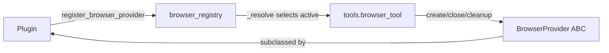

# Explore how the Hermes Agent interact with browser tool #
## browser_registry.py ##
Updated todo list

The file browser_registry.py is a small, focused module that acts as the **central registry for cloud browser providers**. Here's a breakdown:

### Purpose
It keeps a lookup table of available cloud browser backends (Browser Use, Browserbase, Firecrawl, third-party plugins) and decides which one a `browser_*` tool call should route to.

### State
```python
_providers: Dict[str, BrowserProvider] = {}   # name -> provider
_lock = threading.Lock()                       # guards all access
```
A module-level dict guarded by a lock, so registration and lookup are thread-safe.

### Public API

| Function | What it does |
|----------|--------------|
| `register_provider(provider)` | Adds a provider keyed by `provider.name`. Validates type/name, and re-registering the same name overwrites (handy for hot-reload/tests). Called by plugins at import time via `PluginContext.register_browser_provider`. |
| `list_providers()` | Returns all providers sorted by name. |
| `get_provider(name)` | Fetches one provider by name, or `None`. |
| `_reset_for_tests()` | Clears the registry (test-only). |

### The heart: `_resolve(configured)`
Decides the **active** provider using this precedence:

1. **`configured == "local"`** → return `None`, disabling cloud mode.
2. **Explicit config set** (`browser.cloud_provider`) → return that provider *even if `is_available()` is False*. This is deliberate — the dispatcher then surfaces a precise "X_API_KEY is not set" error rather than silently falling back.
3. **Legacy auto-detect** → walk `_LEGACY_PREFERENCE = ("browser-use", "browserbase")` and return the first one whose `is_available()` is True.
4. Otherwise → `None` (dispatcher falls back to local browser mode).

### Key design intentions (documented in the module)
- **Firecrawl is deliberately excluded from auto-detect.** It shares `FIRECRAWL_API_KEY` with the web-extract plugin, so users who set that key for web extraction must NOT get silently routed to a paid cloud browser. Firecrawl only activates via explicit config.
- **No "single-eligible shortcut"** (unlike `web_search_registry._resolve`) — only the two legacy names are auto-eligible; everything else, including third-party plugins, requires explicit config.
- **`_is_available_safe()`** wraps each provider's `is_available()` in a try/except so a buggy provider can't crash the whole resolution.

### Relationships
- Implements against the `BrowserProvider` ABC in browser_provider.py.
- Consumed by `tools.browser_tool._get_cloud_provider()`, whose historic behavior this registry was carefully written to preserve.

Updated todo list

Read [](file:///home/qzhang8/hermes-agent/agent/browser_provider.py)

The file browser_provider.py defines the **abstract base class (ABC)** that every cloud browser backend must implement. It's the interface contract that the registry (from your last file) stores and resolves.

### Purpose
It defines the pluggable-backend interface for cloud browser providers (Browserbase, Browser Use, Firecrawl, third-party vendors). Providers register instances that then service every cloud-mode `browser_*` tool call.

### The `BrowserProvider` ABC

**Required abstract members** (subclasses must implement all):

| Member | Type | Responsibility |
|--------|------|----------------|
| `name` | property | Stable short ID used in the `browser.cloud_provider` config key (e.g. `browserbase`, `browser-use`, `firecrawl`). Lowercase, hyphens allowed. |
| `is_available()` | method | Cheap check (env var present, dep importable) — **must not** make network calls; runs at registration time and on every `hermes tools` paint. |
| `create_session(task_id)` | method | Creates a cloud session, returns metadata dict. May raise `ValueError`/`RuntimeError`. |
| `close_session(session_id)` | method | Terminates a session; returns bool, should not raise. |
| `emergency_cleanup(session_id)` | method | Best-effort teardown from atexit/signal handlers; must not raise. |

**Optional overridable members** (have defaults):

| Member | Default | Purpose |
|--------|---------|---------|
| `display_name` | returns `name` | Human-readable label in `hermes tools`. |
| `get_setup_schema()` | minimal entry from `display_name` | Provider metadata (badge, API-key prompts, `post_setup` hook) for the `hermes tools` picker. |

### The session metadata contract
`create_session()` must return a dict with at least:
```python
{
    "session_name": str,   # unique name for agent-browser --session
    "bb_session_id": str,  # provider session ID (for close/cleanup)
    "cdp_url": str,        # CDP websocket URL
    "features": dict,      # feature flags enabled
    # optional: "external_call_id" for managed-gateway billing
}
```
Note the `bb_session_id` key is a **legacy name** (originally Browserbase-specific) kept verbatim so `tools.browser_tool` doesn't need translation — it now holds *any* provider's session ID.

### Backward-compat shims
The pre-refactor ABC (`CloudBrowserProvider`) used different method names. To avoid churning ~6 callsites in `tools.browser_tool` and breaking downstream subclasses, two thin aliases are provided:
- `is_configured()` → delegates to `is_available()`
- `provider_name()` → delegates to `display_name`

### Design context (from the module docstring)
- Mirrors `agent.web_search_provider.WebSearchProvider` exactly — same shape, registration flow, and picker integration.
- Replaced the deleted in-tree `tools.browser_providers.base.CloudBrowserProvider` (PR #25214), **preserving the lifecycle contract bit-for-bit** so the dispatcher stays a pure registry lookup with no per-provider conditionals.

### How it fits together


In short: this is the **contract**; browser_registry.py is the **directory**; `tools.browser_tool` is the **consumer**.

In short: **it's pure selection logic** — registering providers and picking the right one — with no capability routing (every browser provider implements the full lifecycle, so there's no search/extract/crawl split like the web subsystem has).
