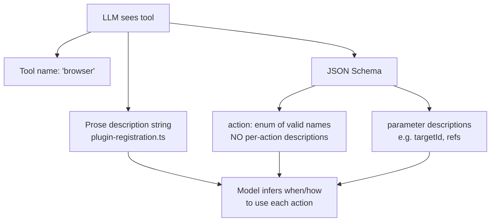

## OpenClaw Browser Tool Invocation

The browser tool is invoked through a layered decision process:

### 1. Tool Registration
The browser is a **core tool** registered in tool-catalog.ts:
```typescript
{
  id: "browser",
  label: "browser",
  description: "Control web browser",
  sectionId: "ui",
  profiles: [],  // Not auto-included in any profile
  includeInOpenClawGroup: true,
}
```

### 2. Plugin-Based Resolution
Unlike bundled core tools, browser comes from the browser plugin and is resolved via `resolveOpenClawPluginToolsForOptions` in openclaw-tools.ts:

```typescript
allTools = [
  ...tools,
  ...resolveOpenClawPluginToolsForOptions({
    options,
    resolvedConfig,
    existingToolNames,
  }),
];
```

### 3. Tool Policy Pipeline
Multiple policy layers in tool-policy-pipeline.ts decide availability:

| Policy Layer | Config Key | Purpose |
|--------------|------------|---------|
| Profile | `tools.profile` | Explicit profile allowlist |
| Provider | `tools.byProvider.profile` | Provider-specific tools |
| Global | `tools.allow` / `tools.byProvider.allow` | Global allow |
| Deny | `tools.deny` / `tools.byProvider.deny` | Explicit deny |
| Agent | Agent-specific policies | Per-agent overrides |
| Sandbox | `tools.sandbox.tools.deny` | Sandbox restrictions |

### 4. Factory Policy Merge
mergeFactoryPolicyList combines:
- `tools.allow`
- `tools.alsoAllow`  
- Plugin allowlists

### 5. Sandbox Tool Policy
The sandbox tool policy can explicitly block browser:
```typescript
tools: { sandbox: { tools: { deny: ["browser"] } } }
```

### 6. Runtime Requirements
Browser execution also depends on:
- Chrome/Chromium executable availability
- CDP connection establishment
- Sandbox bridge URL (when sandboxed)
- `OPENCLAW_BROWSER_COLOR` / `OPENCLAW_BROWSER_PROFILE_NAME` defaults

### Summary Flow
```
Config + Plugin Resolution
        ↓
Tool Policy Pipeline (allow/deny layers)
        ↓
Factory Policy Merge (allowlists)
        ↓
Sandbox Tool Policy (optional block)
        ↓
Runtime Context (Chrome available?)
        ↓
Browser Tool Invoked
```

## Browser Tool Commands

The browser tool (`browser`) in OpenClaw provides these main actions:

### Control Actions

| Action | Description |
|--------|-------------|
| `status` | Get browser status |
| `start` | Start browser |
| `stop` | Stop browser |
| `doctor` | Run browser diagnostics |

### Profile Management

| Action | Description |
|--------|-------------|
| `profiles` | List browser profiles |
| `createProfile` | Create a browser profile |
| `deleteProfile` | Delete a browser profile |
| `resetProfile` | Reset a browser profile |

### Tab Operations

| Action | Description |
|--------|-------------|
| `tabs` | List open tabs |
| `open` | Open a new tab |
| `focus` | Focus a tab |
| `close` | Close a tab |

### Navigation & Page Actions

| Action | Description |
|--------|-------------|
| `navigate` | Navigate to URL |
| `snapshot` | Capture page snapshot |
| `screenshot` | Take screenshot |
| `console` | Get console messages |
| `pdf` | Save page as PDF |

### Dialog & File Handling

| Action | Description |
|--------|-------------|
| `dialog` | Handle dialogs |
| `upload` | File upload |

### Element Actions (`act`)

The `act` action supports these interaction kinds:

| Kind | Description |
|------|-------------|
| `click` | Click element |
| `clickCoords` | Click by coordinates |
| `type` | Type text |
| `press` | Press key |
| `hover` | Hover over element |
| `drag` | Drag element |
| `select` | Select dropdown option |
| `fill` | Fill form fields |
| `resize` | Resize viewport |
| `wait` | Wait for condition |
| `evaluate` | Execute JavaScript |
| `close` | Close tab via CDP |

### Targets

Browser commands can target different locations:

- `sandbox` - Isolated OpenClaw-managed browser
- `host` - User's logged-in browser
- `node` - Node-hosted browser proxy

### Snapshot Formats

- `aria` - ARIA-based references
- `ai` - AI-optimized format

### Image Types

- `png`
- `jpeg`

## 1. The `action` enum (valid names only)

In browser-tool.schema.ts, `action` is a flat `stringEnum`:

```typescript
action: stringEnum(BROWSER_TOOL_ACTIONS),
```

Looking at string-enum.ts, `stringEnum` only emits the valid string values as a JSON Schema `enum`:

```typescript
return Type.Unsafe<T[number]>({
  type: "string",
  ...(enumValues.length > 0 ? { enum: [...enumValues] } : {}),
  ...options,
});
```

So the schema tells the model **which action names are valid** (`doctor`, `status`, `start`, `snapshot`, `act`, etc.) but carries **no individual description** for each one. The action names themselves are self-descriptive tokens.

## 2. The tool's top-level `description` prose

The real semantic guidance comes from the tool's `description` string, hand-written in plugin-registration.ts:

```typescript
description: [
  "Control the browser via OpenClaw's browser control server (status/start/stop/profiles/tabs/open/snapshot/screenshot/actions).",
  "Browser choice: omit profile by default for the isolated OpenClaw-managed browser (`openclaw`).",
  'For the logged-in user browser, use profile="user"...',
  // ... more guidance on refs, tabs, snapshots, act usage
].join(" "),
```

This prose is what teaches the model:
- What actions exist (listed inline)
- How to sequence them (e.g. snapshot → act)
- Behavioral rules (e.g. omit `timeoutMs` for `profile="user"`)

## 3. Selective parameter descriptions

A few individual parameters carry descriptions, like browser-tool.schema.ts:

```typescript
targetId: Type.Optional(Type.String({ description: TAB_REFERENCE_DESCRIPTION })),
```

## Summary



The model relies on **action names + the single prose description**, not structured per-action documentation. There is no field mapping each of the ~18 actions to its own description — the design deliberately keeps the schema flat because provider validators reject nested union shapes.
Updated todo list

There is **one** browser tool exposed to the LLM, named `browser`. It is a single agent tool that multiplexes many operations through its `action` parameter.

## One Tool, 17 Actions

The single `browser` tool supports **17 top-level actions** (from `BROWSER_TOOL_ACTIONS` in browser-tool.schema.ts):

| # | Action |
|---|--------|
| 1 | `doctor` |
| 2 | `status` |
| 3 | `start` |
| 4 | `stop` |
| 5 | `profiles` |
| 6 | `tabs` |
| 7 | `open` |
| 8 | `focus` |
| 9 | `close` |
| 10 | `snapshot` |
| 11 | `screenshot` |
| 12 | `navigate` |
| 13 | `console` |
| 14 | `pdf` |
| 15 | `upload` |
| 16 | `dialog` |
| 17 | `act` |

## Plus 12 `act` Sub-kinds

The `act` action further branches into **12 interaction kinds** (from `BROWSER_ACT_KINDS` in browser-tool.schema.ts): `click`, `clickCoords`, `type`, `press`, `hover`, `drag`, `select`, `fill`, `resize`, `wait`, `evaluate`, `close`.

## Summary

- **1** tool the LLM sees (`browser`)
- **17** actions on that tool
- **12** `act` sub-kinds

The design deliberately uses one tool with a flat `action` enum rather than 17+ separate tools, keeping the model-facing tool surface small and provider-schema-compatible.
